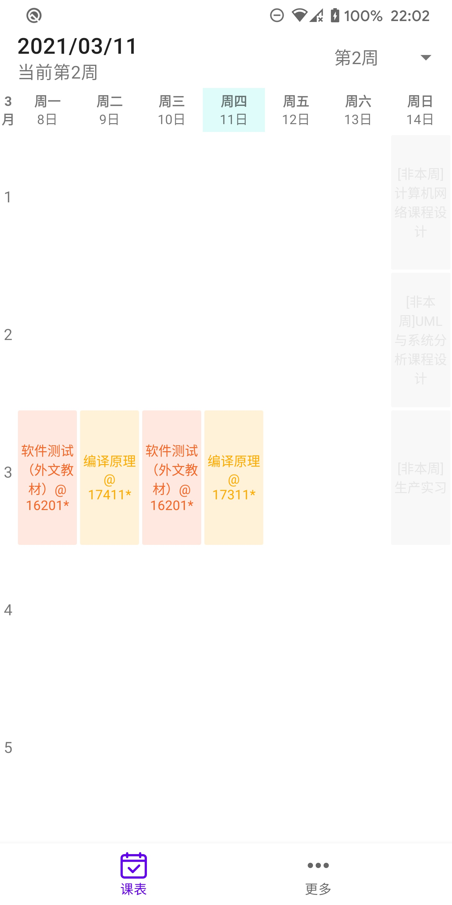
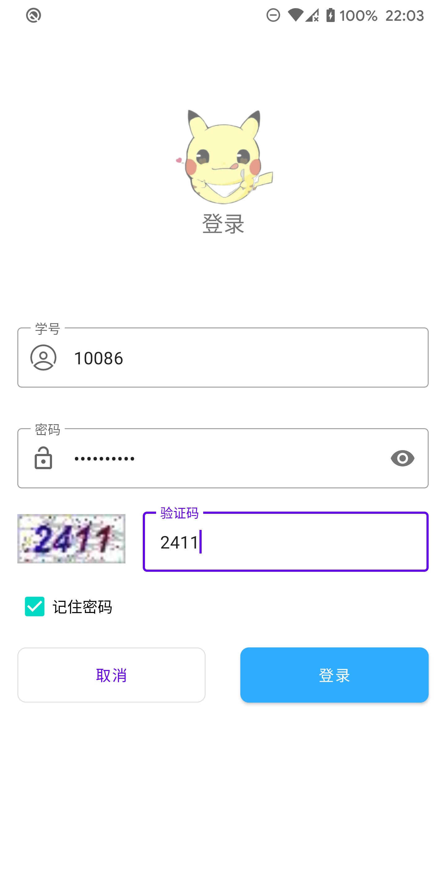
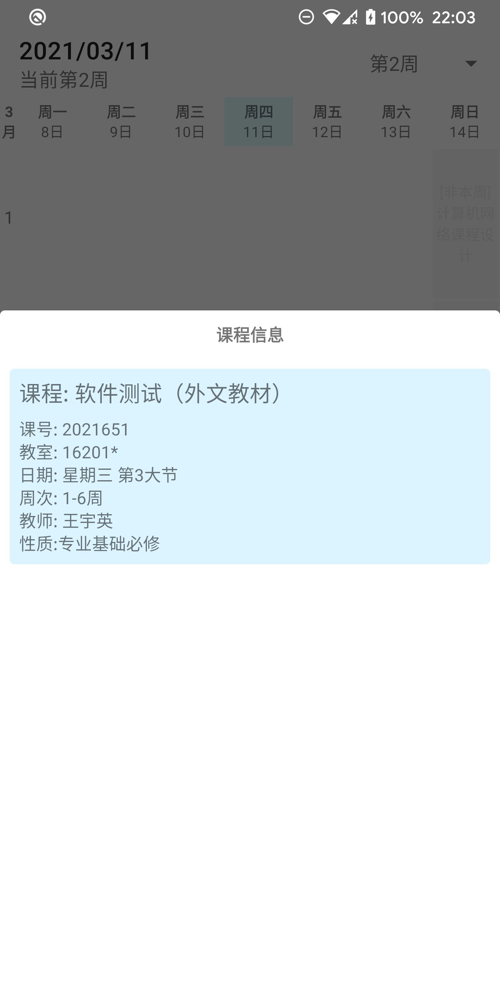

## 桂电课程表
主要使用Kotlin语言进行编写，基于原来的课程表进行重写，功能不是很完善

但运行很流畅
使用kotlin协程框架以及ViewModel优化代码

代码仅供参考

## 用到的开源工具

- Retrofit
- Room
- ViewModel
- Glide
- EventBus
- TimetableView
- LShadowLayout

截图：
{:height="45%" width="45%"}
{:height="45%" width="45%"}
{:height="45%" width="45%"}
